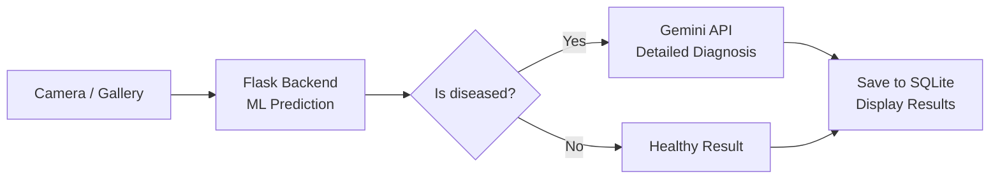

<div align="center">

# Leaf Disease Detection

**A mobile app that identifies plant diseases from leaf photos using AI.**


[](LICENSE)

</div>

---

## Overview

Leaf Disease Detection lets you take or pick a photo of a plant leaf and get an instant diagnosis. The app supports two analysis paths: a **Flask backend** for ML-based prediction and the **Gemini API** for detailed disease identification with recommendations. All results are stored locally in a SQLite database.

> [!NOTE]
> This project is designed as a **full-stack prototype**. The Flask backend handles the initial prediction, while the Gemini API provides the enriched diagnosis. Both can be used independently or together.

## Features

- **Camera & Gallery** — Capture a leaf photo directly or pick one from your gallery
- **AI-powered diagnosis** — Gemini API returns the disease name, confidence score, description, and treatment recommendations
- **ML prediction fallback** — Flask backend provides an initial disease prediction before the full Gemini analysis
- **Detection history** — SQLite stores all past analyses, viewable in a date-grouped activity log
- **Image gallery** — Browse all previously scanned leaf images
- **Step-by-step guide** — In-app onboarding explains how to use the app

## How it works



1. User captures or selects a leaf image
2. Image is sent to the Flask backend for a quick ML prediction
3. If a disease is detected, the Gemini API provides a detailed analysis (disease name, confidence, description, recommendations)
4. Results are displayed and saved locally to SQLite

## Getting started

### Prerequisites

- [Node.js](https://nodejs.org/) 18+
- [Expo CLI](https://docs.expo.dev/get-started/installation/)
- A [Gemini API key](https://aistudio.google.com/app/apikey)

### Setup

Clone the repository and install dependencies:

```bash
git clone https://github.com/your-username/leaf-disease-detection-react-native-app-flask.git
cd leaf-disease-detection-react-native-app-flask
npm install
```

Create a `.env` file at the project root:

```env
EXPO_PUBLIC_GEMINI_API_KEY=your_gemini_api_key_here
EXPO_PUBLIC_BACKEND_URL=http://your-flask-server:5000
```

Start the app:

```bash
npx expo start
```

Scan the QR code with Expo Go, or press `a` for Android emulator / `i` for iOS simulator.

## Project structure

```
├── app/                    # Expo Router pages (file-based routing)
│   ├── (tabs)/            # Bottom tab navigation screens
│   │   ├── index.tsx      # Home screen
│   │   ├── scanner.tsx    # Camera / image picker
│   │   ├── galerie.tsx    # Scanned image gallery
│   │   └── activity.tsx   # Detection history
│   ├── result/result.tsx  # Disease analysis result
│   ├── waiting/           # Analysis loading screen
│   ├── guide/             # User guide
│   └── settings/          # App settings
├── actions/               # API call functions
├── components/            # Reusable UI components
├── constants/             # Colors, routes, guide data
├── hooks/                 # Custom React hooks
├── utils/                 # SQLite database utility
└── config.ts              # App configuration
```

## Tech stack

| Layer | Technology |
|-------|-----------|
| **Framework** | React Native (Expo) |
| **Language** | TypeScript |
| **Navigation** | Expo Router (file-based) |
| **AI** | Gemini API (`@google/generative-ai`) |
| **Backend** | Flask (Python) — optional |
| **Storage** | SQLite (`expo-sqlite`) |
| **Camera** | Expo Camera |
| **Images** | Expo Image Picker & File System |

## Screens

| Screen | Purpose |
|--------|---------|
| **Home** | Welcome card, feature shortcuts, recent diseases preview |
| **Scanner** | Camera view + gallery picker to capture leaf images |
| **Result** | Displays diagnosis, confidence, description, and recommendations |
| **Activity** | Detection history grouped by date |
| **Gallery** | Grid of all scanned leaf images |
| **Guide** | Step-by-step instructions for using the app |
